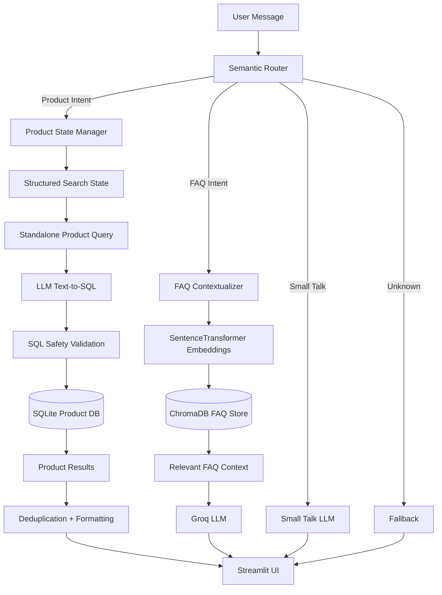
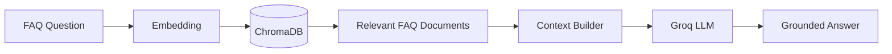

# 🛍️ E-commerce AI Chatbot

### Conversational Product Search + FAQ RAG + Text-to-SQL + Context-Aware Memory

An end-to-end GenAI e-commerce assistant that understands natural-language shopping requests, searches products using SQL, answers policy-related questions using RAG, and maintains conversational context across follow-up queries.


**Live App:** [E-commerce AI Chatbot](https://genai-ecommerce-chatbot-flipkart.streamlit.app/)
---

## ✨ What Makes This Project Different?

Traditional e-commerce search often requires users to manually select multiple filters.

Instead, this assistant allows users to communicate naturally:

> **"Show me Adidas shoes under ₹3000."**

Then continue:

> **"Only those rated above 4."**

Then:

> **"Any brand is fine."**

Then:

> **"Give me the best 1 only."**

The chatbot maintains the evolving product-search context and converts each request into a structured search before querying the product catalog.

---

## 🚀 Core Features

- 🛒 **Natural-Language Product Search**
- 🧠 **Context-Aware Multi-Turn Conversations**
- 🔄 **Dynamic Search-State Updates**
- 🗃️ **LLM-powered Text-to-SQL**
- 📚 **FAQ Retrieval-Augmented Generation**
- 🧭 **Semantic Intent Routing**
- 💬 **Small-Talk Handling**
- 🔍 **SentenceTransformer Embeddings**
- 🧱 **Persistent ChromaDB Vector Store**
- 🗄️ **SQLite Product Database**
- 🔒 **Read-Only SQL Safety Layer**
- ♻️ **Automatic Data Bootstrap**
- 🧹 **Product Deduplication**
- 🔗 **Clean Clickable Product Links**
- 🎨 **Streamlit Chat Interface**

---

# 🧠 System Architecture



---

# 🔄 Conversational Product Memory

One of the main improvements in this project is separating **UI chat history** from **backend search state**.

Instead of repeatedly passing the entire conversation to the model, the application maintains structured product-search memory.

Example:

```python
{
    "product_type": "shoes",
    "brand": "Adidas",
    "min_price": None,
    "max_price": 3000,
    "min_rating": 4,
    "min_discount": None,
    "limit": 1,
    "sort": "best"
}
```

This allows the assistant to understand conversations such as:

```text
User:
Show me Nike shoes under 3000

Assistant:
[Results]

User:
What about Adidas?

System understands:
Show me Adidas shoes under 3000

User:
Only those rated above 4

System understands:
Show me Adidas shoes under 3000 with rating above 4

User:
Any brand is fine

System removes:
brand = Adidas
```

This is more reliable than blindly passing large chat histories back into every LLM request.

---

# 🧭 Semantic Routing

The chatbot uses **SentenceTransformer embeddings** to classify each query into one of the supported routes.

```text
User Query
    │
    ▼
Semantic Router
    │
    ├── FAQ
    │
    ├── Product Search
    │
    ├── Small Talk
    │
    └── Unknown / Fallback
```

The router uses:

```text
sentence-transformers/all-MiniLM-L6-v2
```

with a tuned similarity threshold.

---

# 🛒 Product Search Pipeline

Product-related requests use a Text-to-SQL workflow.


Example request:

```text
Show me Adidas shoes under ₹2500 with rating above 4
```

The model converts the requirement into SQL similar to:

```sql
SELECT *
FROM product
WHERE LOWER(brand) LIKE LOWER('%Adidas%')
  AND price < 2500
  AND avg_rating > 4
ORDER BY avg_rating DESC, total_ratings DESC
LIMIT 10;
```

The application then executes the query against SQLite and formats the retrieved products deterministically.

---

## 🔐 SQL Safety

Generated SQL is validated before execution.

The application:

- Allows only `SELECT`
- Blocks multiple SQL statements
- Blocks destructive commands such as:
  - `INSERT`
  - `UPDATE`
  - `DELETE`
  - `DROP`
  - `ALTER`
  - `CREATE`
  - `PRAGMA`
- Opens SQLite in query-only mode

```python
conn.execute("PRAGMA query_only = ON")
```

This reduces the risk of an LLM generating destructive database operations.

---

# 📚 FAQ RAG Pipeline

Policy-related queries follow a separate Retrieval-Augmented Generation workflow.



Example questions:

```text
What is your return policy?
```

```text
How long does a refund take?
```

```text
Can I pay using UPI?
```

```text
What should I do if my product arrives damaged?
```

The LLM is instructed to answer using only the retrieved FAQ context.

---

# 🧩 Why No LangChain?

The core RAG pipeline was intentionally implemented without relying heavily on orchestration frameworks.

This made it possible to understand each step directly:

```text
Embedding
   ↓
Vector Search
   ↓
Context Retrieval
   ↓
Prompt Construction
   ↓
LLM Generation
```

The same principle was used for Text-to-SQL and conversational state management.

The goal was to understand the underlying architecture rather than hide the workflow behind abstractions.

---

# 🗃️ Data Layer

The project uses two separate data systems.

| Data | Storage | Purpose |
|---|---|---|
| Product Catalog | SQLite | Structured filtering, ranking and search |
| FAQ Knowledge Base | ChromaDB | Semantic retrieval |
| Raw Product Data | CSV | Rebuild SQLite |
| Raw FAQ Data | CSV | Rebuild ChromaDB |

The application automatically creates its local database and vector store when required.

```text
Raw CSV
   ↓
data_setup.py
   ↓
SQLite + ChromaDB
   ↓
Application Ready
```

This makes the repository reproducible on a fresh environment.

---

# 📂 Project Structure

```text
ecommerce-chatbot/
│
├── app.py
│
├── README.md
├── requirements.txt
├── requirements-dev.txt
├── .env.example
├── .gitignore
│
├── data/
│   ├── raw/
│   │   ├── ecommerce_data_final.csv
│   │   └── faq_data.csv
│   │
│   ├── ecommerce.db
│   └── chroma_db/
│
├── notebooks/
│   ├── 01_embeddings_chromadb.ipynb
│   ├── 02_sqlite_text_to_sql.ipynb
│   ├── 03_semantic_router.ipynb
│   └── 04_end_to_end_pipeline.ipynb
│
└── src/
    ├── __init__.py
    ├── config.py
    ├── context.py
    ├── data_setup.py
    ├── faq_chain.py
    ├── router.py
    ├── smalltalk.py
    └── sql_chain.py
```

> `ecommerce.db` and `chroma_db/` are generated locally and are not committed to Git.

---

# 🧰 Technology Stack

| Area | Technology |
|---|---|
| Language | Python |
| Frontend | Streamlit |
| LLM | Groq |
| Embeddings | SentenceTransformers |
| Vector Database | ChromaDB |
| Structured Database | SQLite |
| Intent Routing | Semantic Router |
| Data Processing | Pandas, NumPy |
| Environment Management | python-dotenv |
| Development | JupyterLab |

---

# ⚙️ Local Setup

## 1. Clone the repository

```bash
git clone https://github.com/<your-username>/<your-repository>.git
cd ecommerce-chatbot
```

---

## 2. Create a virtual environment

### Windows

```bash
python -m venv .venv
```

Activate:

```bash
.venv\Scripts\activate
```

---

## 3. Install dependencies

For running the application:

```bash
pip install -r requirements.txt
```

For development and notebooks:

```bash
pip install -r requirements-dev.txt
```

---

## 4. Configure environment variables

Create a `.env` file in the project root.

```env
GROQ_API_KEY=your_groq_api_key
GROQ_MODEL=your_groq_model
```

Never commit the `.env` file.

---

## 5. Run the application

```bash
streamlit run app.py
```

The application automatically prepares the SQLite product database and ChromaDB FAQ collection when necessary.

---

# 💬 Example Conversations

<details>
<summary><b>🛍️ Product Search</b></summary>

<br>

```text
User:
Show me Nike shoes under 3000

User:
What about Adidas?

User:
Only those rated above 4

User:
Any brand is fine

User:
Give me the best 1 only
```

The assistant continuously modifies the same structured product-search state.

</details>

---

<details>
<summary><b>📚 FAQ RAG</b></summary>

<br>

```text
User:
What is your return policy?

User:
How many days exactly?
```

The FAQ contextualizer converts the follow-up into a complete question before semantic retrieval.

</details>

---

<details>
<summary><b>💬 Small Talk</b></summary>

<br>

```text
User:
Hello

User:
What can you do?
```

Small-talk messages are handled independently and do not overwrite the active product or FAQ context.

</details>

---

# 🧪 Development Workflow

The project was first built step-by-step in notebooks to understand the individual components.

### Notebook 01 — Embeddings + ChromaDB

Covered:

- Sentence embeddings
- Cosine similarity
- Semantic search
- FAQ ingestion
- ChromaDB retrieval
- Manual RAG pipeline

### Notebook 02 — SQLite + Text-to-SQL

Covered:

- Product database creation
- SQL filtering
- Natural-language-to-SQL generation
- Query safety
- Product response generation

### Notebook 03 — Semantic Routing

Covered:

- Manual semantic routing
- Embedding similarity
- Route thresholds
- `semantic-router`

### Notebook 04 — End-to-End Pipeline

Integrated:

```text
Router
+
FAQ RAG
+
Product SQL
+
Small Talk
+
Fallback
```

The working notebook pipeline was then refactored into reusable production modules under `src/`.

---

# 🧠 Key Learning Outcomes

This project helped explore the difference between simply calling an LLM and building an actual GenAI system.

Key concepts implemented include:

- Embeddings
- Semantic similarity
- Vector databases
- RAG
- Prompt grounding
- Text-to-SQL
- LLM safety validation
- Semantic routing
- Conversational context
- Structured state management
- Deterministic post-processing
- Modular GenAI architecture
- Application deployment patterns

---

# ⚠️ Current Limitations

This project is intentionally a learning-focused prototype rather than a full production commerce platform.

Current limitations include:

- Product inventory is static rather than real-time.
- Product availability cannot be verified.
- The dataset contains a limited set of product attributes.
- Some advanced conversational actions are not yet implemented.
- Human-agent escalation is not connected to a customer-service platform.
- Conversation memory exists only for the active Streamlit session.
- Product ranking uses available catalog signals rather than a learned recommendation model.

---

# 🔮 Future Improvements

Possible production extensions include:

### Dialogue Management

Support explicit conversational actions such as:

```text
NEXT_RESULT
REJECT_RESULT
REMOVE_FILTER
RESET_SEARCH
CANCEL_SEARCH
ESCALATE_TO_HUMAN
```

---

### Product Recommendation Memory

Maintain:

```python
shown_product_ids
rejected_product_ids
current_result_index
```

to support conversations such as:

```text
Show me the second best option.
```

```text
I don't like this one.
```

```text
Show me another.
```

---

### Live Commerce Integration

Integrate real-time services for:

- Inventory
- Pricing
- Product variants
- Delivery availability
- Order status
- Customer support

---

### Conversational Shopping Page

Instead of returning only chatbot messages, natural-language requirements could dynamically create a filtered product listing page.

Example:

```text
I want black Nike or Adidas running shoes,
size 8, under ₹5000.
```

The assistant could convert this into structured filters and directly render a personalized catalog.

```text
Natural Language
      ↓
Structured Preferences
      ↓
Search / Ranking
      ↓
Dynamic Product Page
```

---

### Evaluation Suite

Build automated multi-turn conversation tests covering:

- Filter addition
- Filter removal
- Brand switching
- Price changes
- Ranking changes
- FAQ follow-ups
- Route switching
- Unknown queries

---

# 🎯 Project Goal

The purpose of this project was not simply to build a chat interface.

The goal was to understand how different GenAI components can work together as a complete system:

```text
LLM
+
Embeddings
+
Vector Search
+
Structured Search
+
Routing
+
Conversational State
+
Application Logic
```

---

# 👤 Author

**Krushang Patel**

Data Science • Machine Learning • GenAI • RAG • AI Applications

[GitHub](https://github.com/Krushang010)

---

⭐ If you found this project useful, consider giving the repository a star.